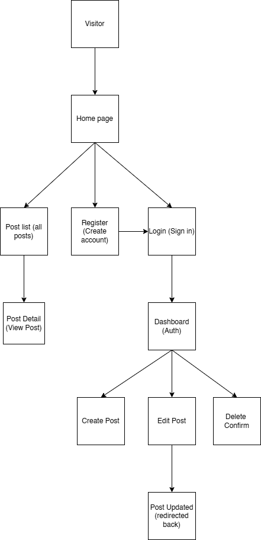

---
#Mathematics Learning Blog (Django Full-Stack Application)**
---
# Mathematics Learning Blog

The **Mathematics Learning Blog** is a full-stack Django application designed to provide an educational space where visitors can read maths articles, and registered authors can publish detailed explanations, concepts, and problem-solving guides.

The project demonstrates full CRUD functionality, authentication, an MVC framework, responsive design, thorough testing, and deployment to a cloud platform.
All sensitive data (SECRET_KEY, database URL, etc.) is handled securely using environment variables.

---

## Table of Contents

* [Mock-Up Screenshots](#mock-up-screenshots)
* [Basic Content](#basic-content)
* [User Experience (UX)](#user-experience-ux)

  * [Target Audience](#target-audience)
  * [User Stories](#user-stories)
* [Pre-development: Design &amp; Database Choices](#pre-development-design--database-choices)

  * [Colour Scheme](#colour-scheme)
  * [Typography](#typography)
  * [Wireframes](#wireframes)
  * [Flow Diagram](#flow-diagram)
  * [ERD](#erd)
* [Features](#features)
* [Tools and Technologies Used](#tools-and-technologies-used)
* [Agile Development](#agile-development)
* [Testing](#testing)
* [Deployment](#deployment)
* [Credits](#credits)

---

## Mock-Up Screenshots

*Add your screenshots here:*

```


```

---

## Basic Content

The Mathematics Learning Blog allows users to:

* Browse public maths posts
* View full article pages
* Register an account
* Log in to access author tools
* Create, edit, and delete posts
* Receive clear feedback messages after each action

All sensitive credentials are managed through environment variables for security.

---

# User Experience (UX)

## Target Audience

This project was created for:

* Students learning mathematics
* Tutors and teachers who want to publish content
* General learners researching maths topics
* Registered authors who write educational content

---

## User Stories

### **Visitors / Unregistered Users**

* As a visitor, I want to browse mathematics posts.
* As a visitor, I want to read full blog posts.
* As a visitor, I want the site to be easy to use and accessible.

### **Registered Authors**

* As an author, I want to register for an account.
* As an author, I want to log in securely.
* As an author, I want to create new blog posts.
* As an author, I want to edit my posts.
* As an author, I want to delete posts.
* As an author, I want feedback messages after actions (success or error).

### **Administrator**

* As an admin, I want full control of users and posts via Django Admin.

### **Future Enhancements**

* Comment system
* Search functionality
* Post categories and tags
* LaTeX/MathJax rendering for equations
* Bookmark or favourite posts

---

# Pre-development: Design & Database Choices

## Colour Scheme

A clean and high-contrast palette was chosen to support long-form reading and accessibility.

```

```

---

## Typography

Fonts selected for readability:

* **Open Sans**
* **Roboto**
* **Inter**

---

## Wireframes

```

```

---

## Flow Diagram

### Visitor Flow

Home → Blog List → Blog Detail → Register / Login (optional)

### Author Flow

Login → Dashboard → Create / Edit / Delete → View updates with messages



## ERD

```
+---------+       1 ─────── ∞     +---------+
|  User   |----------------------->|  Post   |
| (Django)|                        |         |
+---------+                        +---------+
```

**Data Dictionary**

## Data Dictionary

### User Model (Django built-in)

The project uses Django’s built-in `User` model for authentication.  
Below are the key fields used in this project:

| Field Name   | Type             | Description                                      | Constraints / Notes                                      |
|--------------|------------------|--------------------------------------------------|----------------------------------------------------------|
| id           | Integer (PK)     | Unique ID for each user                          | Auto-generated primary key                               |
| username     | String           | Unique name used to log in                       | Required, unique, max length ~150                        |
| email        | String           | Email address of the user                        | Optional by default, can be enforced as unique if needed |
| password     | Hashed String    | Hashed password for user authentication          | Required, stored as a hash (not plain text)              |
| date_joined  | DateTime         | Timestamp when the account was created           | Auto-set by Django                                       |
| is_active    | Boolean          | Whether the account is active                    | Defaults to True                                         |
| is_staff     | Boolean          | Whether the user can access the admin interface  | Defaults to False                                        |
| is_superuser | Boolean          | Full admin permissions flag                      | Defaults to False                                        |

---

### Post Model

The `Post` model stores each mathematics blog article, linking it to a `User` (the author).

| Field Name | Type                | Description                                  | Constraints / Validation                                                |
|-----------|---------------------|----------------------------------------------|-------------------------------------------------------------------------|
| id        | Integer (PK)        | Unique ID for each post                      | Auto-generated primary key                                              |
| author    | ForeignKey → User   | User who created the post                    | Required, on delete: CASCADE                                            |
| title     | CharField           | Title of the maths blog post                 | Required, max_length=200                                                |
| slug      | SlugField           | URL-friendly version of the title            | Unique, used for clean URLs                                             |
| content   | TextField           | Main maths explanation / article body        | Required, minimum length validated in form                              |
| created_at| DateTimeField       | Date and time when the post was created      | `auto_now_add=True`                                                     |
| updated_at| DateTimeField       | Date and time when the post was last updated | `auto_now=True`                                                         |
| status    | CharField           | Visibility status of the post                | Choices: `draft` / `published`, default=`draft`, max_length=10          |


```
## ERD (Entity Relationship Diagram)

+---------------------------+     1      1     +---------------------------+
|           User            |----------------->|          Profile          |
+---------------------------+                  +---------------------------+
| id (PK)                   |                  | id (PK)                  |
| username                  |                  | user_id (FK → User.id)   |
| email                     |                  +---------------------------+
| password (hashed)         |
| is_staff                  |
| is_superuser              |
| is_active                 |
+---------------------------+
          |
          | 1
          |        ∞
          v
+---------------------------+
|           Post            |
+---------------------------+
| id (PK)                  |
| author_id (FK → User.id) |
| title                    |
| slug (unique)            |
| content                  |
| created_at               |
| updated_at               |
| status                   |
+---------------------------+
          |
          | 1
          |        ∞
          v
+---------------------------+
|         Comment           |
+---------------------------+
| id (PK)                  |
| post_id (FK → Post.id)   |
| author_id (FK → User.id) |
| content                  |
| created_at               |
| approved                 |
+---------------------------+

```

# Features

### Public Features

* Homepage listing all maths posts
* Post detail pages
* Fully responsive layout
* Accessible design

### Author Features

* Registration
* Login/Logout
* Dashboard
* Create maths blog posts
* Edit posts
* Delete posts
* Server-side form validation
* Visual user feedback (success/error messages)

### Admin Features

* Full CRUD via Django Admin
* Manage authors and posts

---

# Tools and Technologies Used

### Core Stack

* **Python 3**
* **Django Framework**
* **HTML5, CSS3, JavaScript**
* **SQLite (development)**

### Developer and Deployment Tools

* Git & GitHub
* GitHub Projects (Agile Kanban)
* VS Code
* Heroku / Render deployment
* PE8 CI Linting
* Django Messages Framework

---

# Agile Development

The project was developed using Agile principles with:

* **Epics**, broken into:

  * Authentication
  * CRUD Blog Posts
  * Database Design
  * UX & Frontend
  * Testing
  * Deployment
* **User stories** linked to tasks
* **GitHub Issues** with labels
* **Kanban board** for sprint organisation


# Deployment

The Mathematics Learning Blog was deployed to a cloud platform using these steps:

1. Create a new app on Heroku or Render
2. Set environment variables (SECRET_KEY, DEBUG, DATABASE_URL)
3. Add `requirements.txt`
4. Add `Procfile` (Heroku)
5. Push project to GitHub
6. Connect repo to deployment platform
7. Deploy
8. Test deployed version for consistency

Security Measures:

* DEBUG=False in production
* Environment variables for secrets
* `.gitignore` excludes sensitive files

---

# Credits

### Code & Documentation Resources

* Django Documentation
* W3C Validators
* StackOverflow
* Code Institute
* ChatGPT (debug support, explanations)

### Acknowledgements

Thanks to classmates, instructors, and mentors for feedback and guidance during development.

---

# 8. Summary

All key requirements for a fully functioning CRUD application were tested thoroughly.
Authentication, responsiveness, and database operations all behave as expected.

---
