---
#Mathematics Learning Blog (Django Full-Stack Application)**
---
# MathsIsIt Notes Blog

The **MathsIsIt Notes Blog** is a full-stack Django application designed to provide an educational space where visitors can read maths articles, and registered authors can publish detailed explanations, concepts, and problem-solving guides.

---

## Table of Contents

* [About](#about)
* [User Goals](#user-goals)
* [Site Owner Goals](#site-goals)
* [User Experience](#ux)
* [User Stories](#user-stories)
* [Design](#design)
  * [Colours](#colour-scheme)
  * [Fonts](#fonts)
  * [Structure](#structure)
    * [Website-pages](#webpages)
    * [Database](database)
  * [Wireframes](wireframes)
* [Technologies Used](#tech)
* [Features](#features)
* [Validation](#validation)
* [Testing](#testing)
* [Heroku Deployment](#heroku)
* [Credits](#credits)
* [Acknowledgements](#acknowledgements)

---

## Mock-Up Screenshots


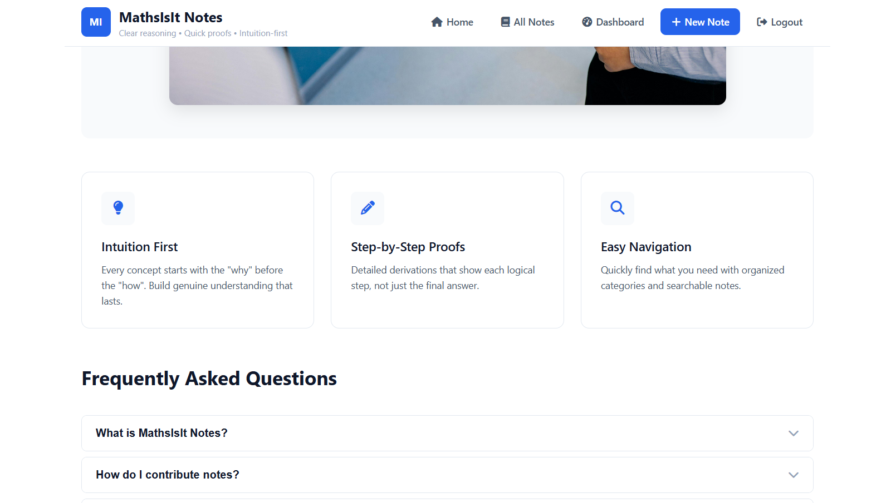
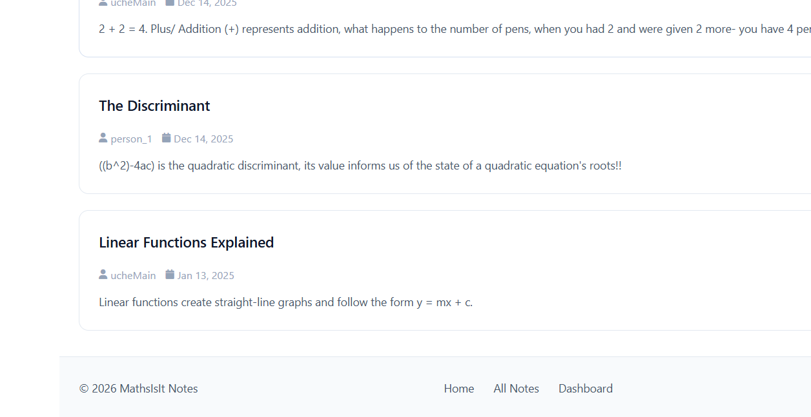


---

## Basic Content

The Mathematics Learning Blog allows users to:

* Browse public maths posts
* View full article pages
* Register an account
* Log in to access author tools
* Create, edit, and delete their own posts
* Receive clear feedback messages after each action

All sensitive credentials are managed through environment variables for security.

---

# Site Goals

# User Experience (UX)

The design was remade to match the following landing page- Here is the wireframe:

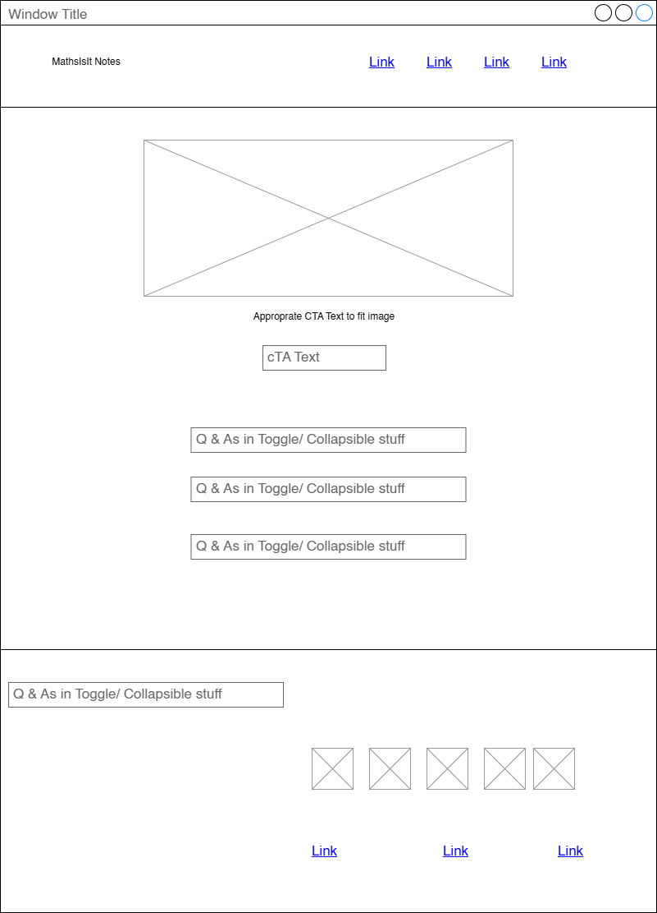

## Target Audience

This project was created for:

* Students learning mathematics
* Tutors and teachers who want to publish content
* General learners researching maths topics
* Registered authors who write educational content

---

## User Stories

#### Expanded User Stories

**Visitors / Unregistered Users**

- As a visitor, I want to easily navigate the site using keyboard and screen reader.
- As a visitor, I want to know the site is accessible and visually clear.
- As a visitor, I want to see clear error messages if I try to access restricted features.

**Registered Authors**

- As an author, I want to receive validation errors if I submit incomplete or invalid forms.
- As an author, I want to be prevented from creating duplicate posts or using duplicate slugs.
- As an author, I want to see confirmation before deleting a post.
- As an author, I want to be notified if my session expires and I need to log in again.

**Administrator**

- As an admin, I want to filter and search users and posts in the admin panel.
- As an admin, I want to see audit trails of post edits (future enhancement).

**General**

- As any user, I want the site to be responsive and usable on all devices.
- As any user, I want the site to meet accessibility standards (colour contrast, ARIA labels, etc).

### **Visitors / Unregistered Users**

* As a visitor, I want to browse mathematics posts.
* As a visitor, I want to read full blog posts.
* As a visitor, I want the site to be easy to use and accessible.

### **Registered Authors**

* As an author, I want to register for an account.
* As an author, I want to log in securely.
* As an author, I want to create new blog posts.
* As an author, I want to edit my posts.
* As an author, I want to delete posts.
* As an author, I want feedback messages after actions (success or error).

### **Administrator**

* As an admin, I want full control of users and posts via Django Admin.

### **Future Enhancements**

* Comment system
* Search functionality
* Post categories and tags
* LaTeX/MathJax rendering for equations
* Bookmark or favourite post
* Profile pictures and author pages
* Comment system with moderation

---

# Pre-development: Design & Database Choices

## Colour Scheme

A clean, professional palette with blue as the primary colour, chosen to support long-form reading and accessibility.

| Colour Role  | Hex Code    | Usage                             |
| ------------ | ----------- | --------------------------------- |
| Primary      | `#2563eb` | Buttons, links, accents           |
| Primary Dark | `#1d4ed8` | Button hover states               |
| Secondary    | `#059669` | Success states, highlights        |
| Accent       | `#f97316` | Warnings, special calls-to-action |
| Dark         | `#0f172a` | Text, headers                     |
| Light        | `#f8fafc` | Backgrounds, surfaces             |
| Muted        | `#64748b` | Secondary text                    |
| Border       | `#e2e8f0` | Dividers, borders                 |

The colour scheme emphasizes clarity and readability for mathematical content.

---

## Typography

Fonts selected for readability:

* **Open Sans**
* **Roboto**
* **Inter**

---

## Flow Diagram

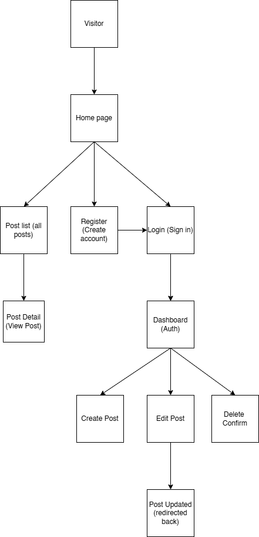

### Visitor Flow

Home → Blog List → Blog Detail → Register / Login (optional)

### Author Flow

Login → Dashboard → Create / Edit / Delete → View updates with messages


## ERD

**Data Dictionary**

## Data Dictionary

### User Model (Django built-in)

The project uses Django’s built-in `User` model for authentication.
Below are the key fields used in this project:

| Field Name   | Type          | Description                                     | Constraints / Notes                                      |
| ------------ | ------------- | ----------------------------------------------- | -------------------------------------------------------- |
| id           | Integer (PK)  | Unique ID for each user                         | Auto-generated primary key                               |
| username     | String        | Unique name used to log in                      | Required, unique, max length ~150                        |
| email        | String        | Email address of the user                       | Optional by default, can be enforced as unique if needed |
| password     | Hashed String | Hashed password for user authentication         | Required, stored as a hash (not plain text)              |
| date_joined  | DateTime      | Timestamp when the account was created          | Auto-set by Django                                       |
| is_active    | Boolean       | Whether the account is active                   | Defaults to True                                         |
| is_staff     | Boolean       | Whether the user can access the admin interface | Defaults to False                                        |
| is_superuser | Boolean       | Full admin permissions flag                     | Defaults to False                                        |

---

### Post Model

The `Post` model stores each mathematics blog article, linking it to a `User` (the author).

| Field Name | Type               | Description                                  | Constraints / Validation                                            |
| ---------- | ------------------ | -------------------------------------------- | ------------------------------------------------------------------- |
| id         | Integer (PK)       | Unique ID for each post                      | Auto-generated primary key                                          |
| author     | ForeignKey → User | User who created the post                    | Required, on delete: CASCADE                                        |
| title      | CharField          | Title of the maths blog post                 | Required, max_length=200                                            |
| slug       | SlugField          | URL-friendly version of the title            | Unique, used for clean URLs                                         |
| content    | TextField          | Main maths explanation / article body        | Required, minimum length validated in form                          |
| created_at | DateTimeField      | Date and time when the post was created      | `auto_now_add=True`                                               |
| updated_at | DateTimeField      | Date and time when the post was last updated | `auto_now=True`                                                   |
| status     | CharField          | Visibility status of the post                | Choices:`draft` / `published`, default=`draft`, max_length=10 |

There is also the Comment model and Contact model.
// write more about it.

```
## ERD (Entity Relationship Diagram)

+---------------------------+     1      1     +---------------------------+
|           User            |----------------->|          Profile          |
+---------------------------+                  +---------------------------+
| id (PK)                   |                  | id (PK)                  |
| username                  |                  | user_id (FK → User.id)   |
| email                     |                  +---------------------------+
| password (hashed)         |
| is_staff                  |
| is_superuser              |
| is_active                 |
+---------------------------+
          |
          | 1
          |        ∞
          v
+---------------------------+
|           Post            |
+---------------------------+
| id (PK)                  |
| author_id (FK → User.id) |
| title                    |
| slug (unique)            |
| content                  |
| created_at               |
| updated_at               |
| status                   |
+---------------------------+
          |
          | 1
          |        ∞
          v
+---------------------------+
|         Comment           |
+---------------------------+
| id (PK)                  |
| post_id (FK → Post.id)   |
| author_id (FK → User.id) |
| content                  |
| created_at               |
| approved                 |
+---------------------------+

```

# Features

## Features

### Home page

- Home page includes nav bar, main body and a footer

<details><summary>See feature images</summary>

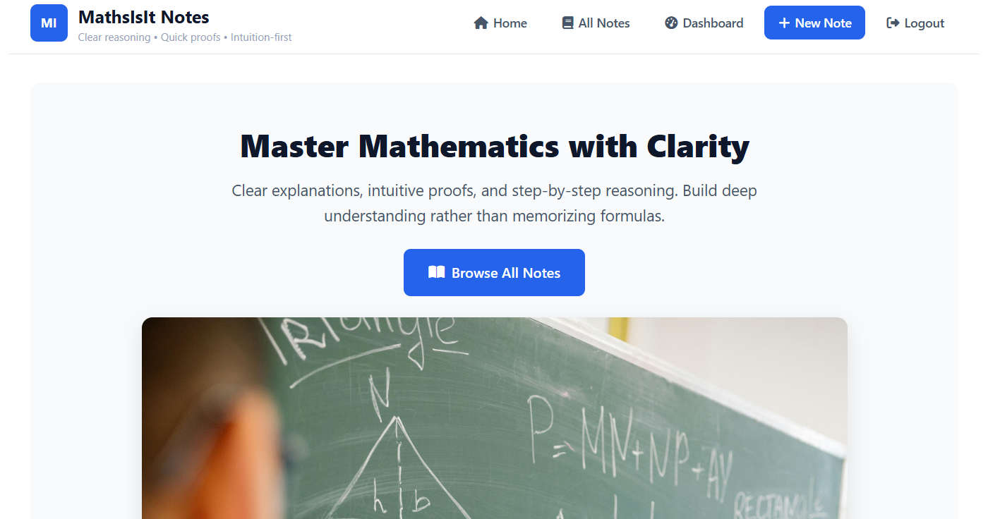

</details>

### Logo & Navigation

- Custom logo for the business
- Fully Responsive
- On small screens switches to hamburger menu
- Indicates login/logout in status
- displayed on all pages

<details><summary>See feature images</summary>

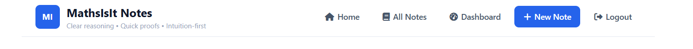

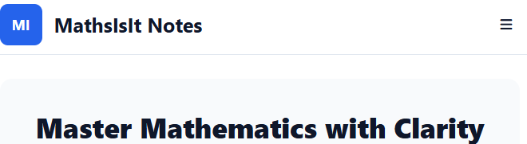

</details>

### Footer

- Contains social media links and copyright
- displayed across all pages

<details><summary>See feature images</summary>


</details>

### Sign up / Register

- Allow users to register an account
- Username and password is required, email is optional

<details><summary>See feature images</summary>

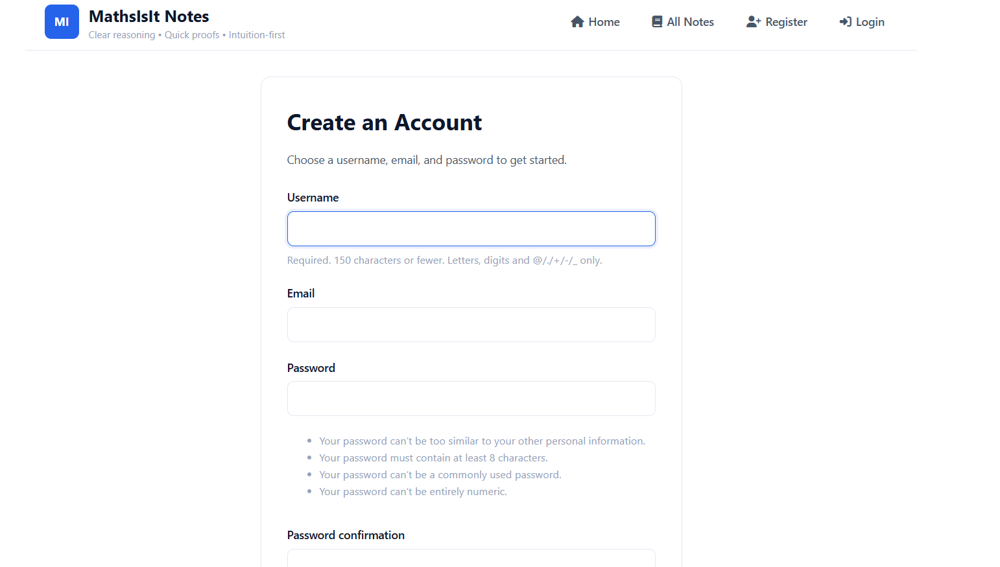

</details>

### Login

- User can login to create a notes, view notes, edit and delete notes

<details><summary>See feature images</summary>

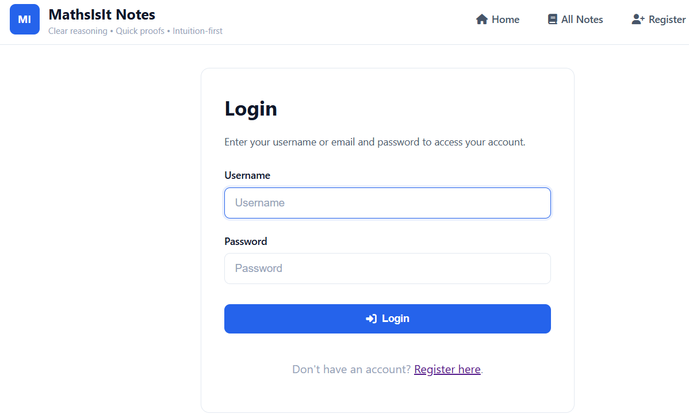


</details>

### Logout

- Allows the user to securely log out
- Ask user if they are sure they want to log out

<details><summary>See feature images</summary>

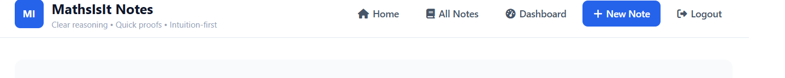

</details>

### Create Notes

- Allows the signed in user to create a maths notes.
- Messages are displayed if the data is not valid such as posts is too short and the email address is not a valid format

<details><summary>See feature images</summary>

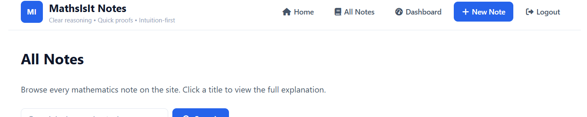
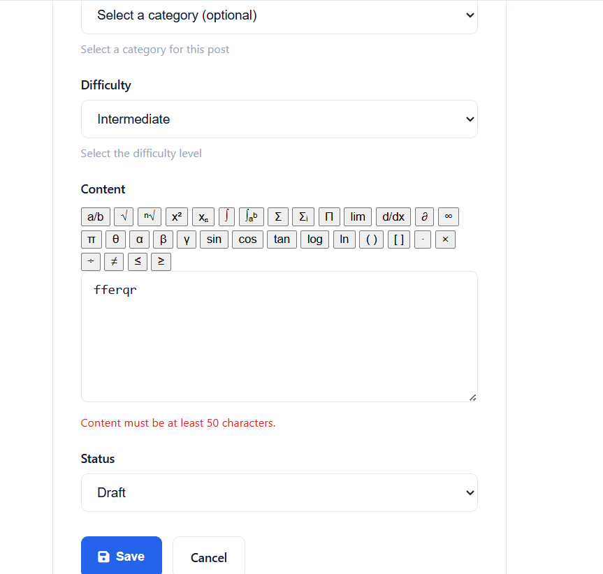


</details>

### My Dashboard

- Allows the user to see all their notes.
- Status of the notes is displayed, whether a draft or a published one.
- It also contains user profile and basic info on the user.

<details><summary>See feature images</summary>

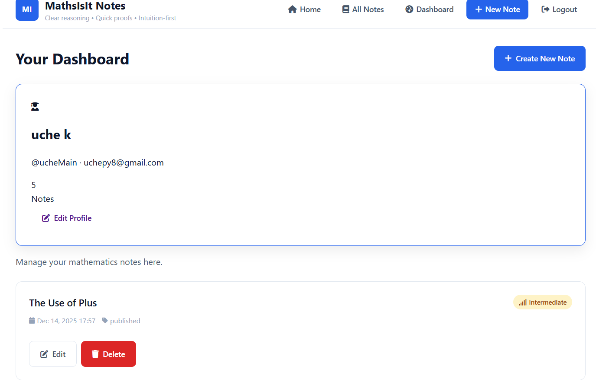

</details>

### Edit notes

- Allows the user to edit their notes

<details><summary>See feature images</summary>

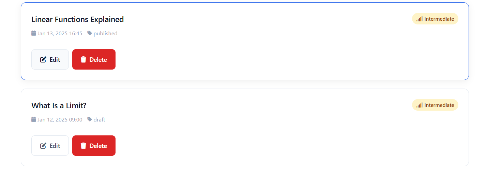
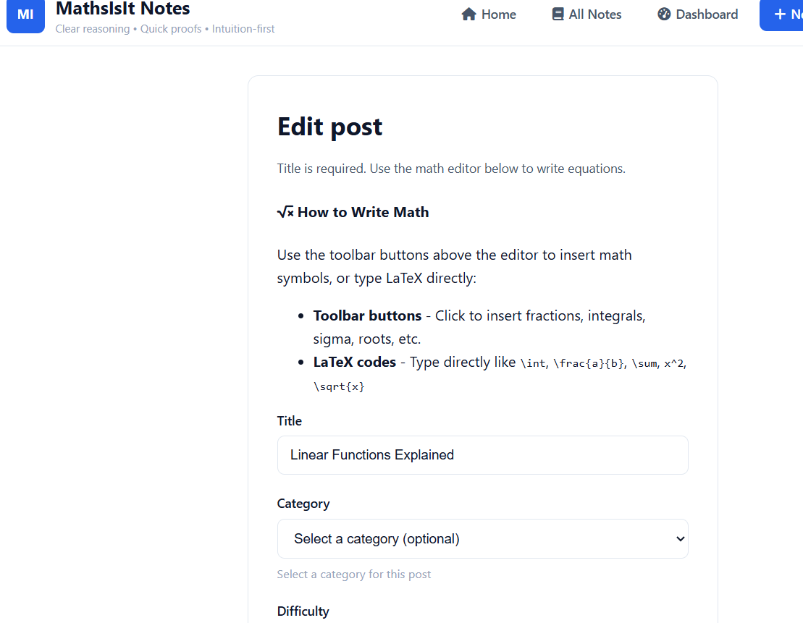

</details>

### Cancel notes

- Allows the user to cancel their notes, asks user are they sure

<details><summary>See feature images</summary>

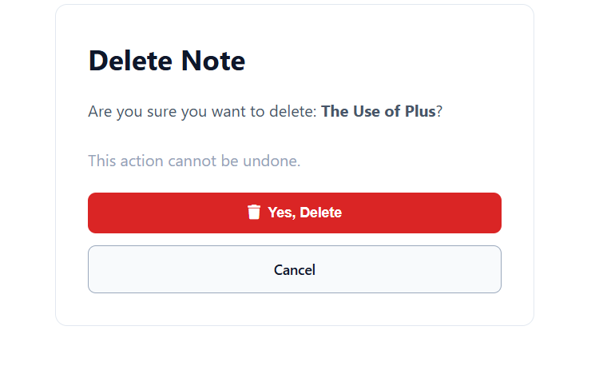

</details>

### Delete notes

- Allows the user to cancel their notes, asks user are they sure

<details><summary>See feature images</summary>

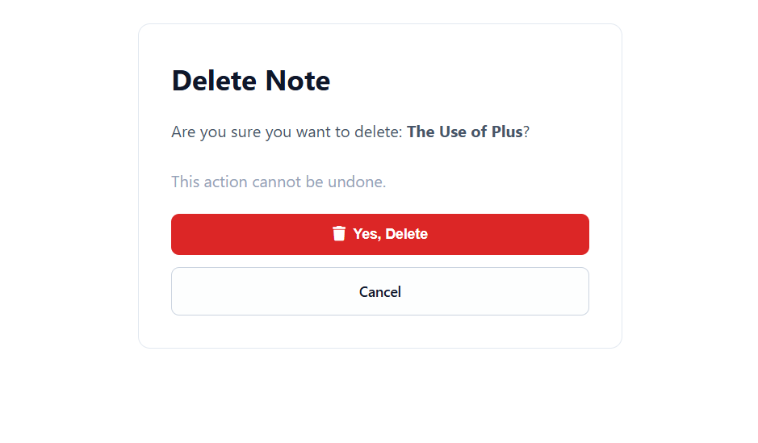

</details>

### Blog

- The blog displays each post made by a user (regardless of type)
- Paginations is used to display 4 posts per page

<details><summary>See feature images</summary>


</details>

### Search function

- Search for posts for ease of use for users

<details><summary>See feature images</summary>

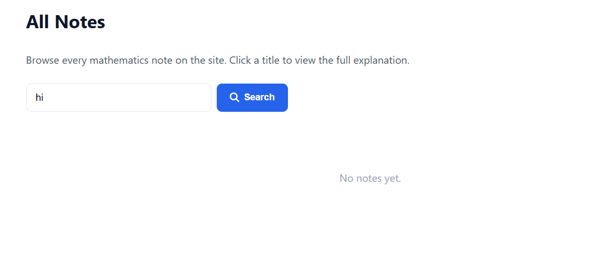

</details>

### Blog Expanded

- Expands into the selected blog the user wishes to read
- Displays a featured image uploaded by the poster
- If no image is uploaded a default image is then used
- Registered user can comment on the blog

<details><summary>See feature images</summary>


</details>

### Comments

- Comments made are set to pending approval status to ensure nothing bad is displayed
- Only registered users can comment on a blog post
- Staff can approve comments via the admin panel on the backend

<details><summary>See feature images</summary>

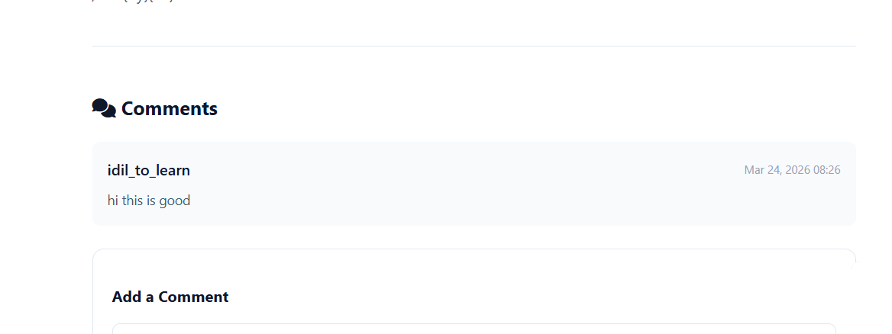

</details>

### Social Media Links

- A logo and link is used for each social media displayed
- All links open in a new tab to ensure user is not directed away from the business
- Displayed on all pages

<details><summary>See feature images</summary>

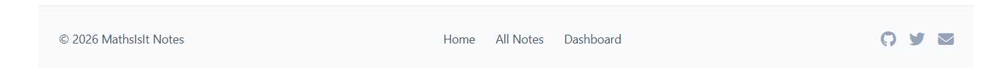

</details>

### Pagination

- Pagination is used on the notes list and the blog page
- Ensures the page is kept tidy as only 4 items are displayed per page

<details><summary>See feature images</summary>

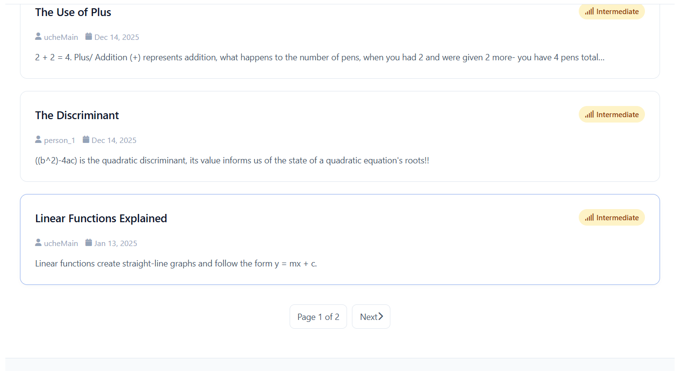
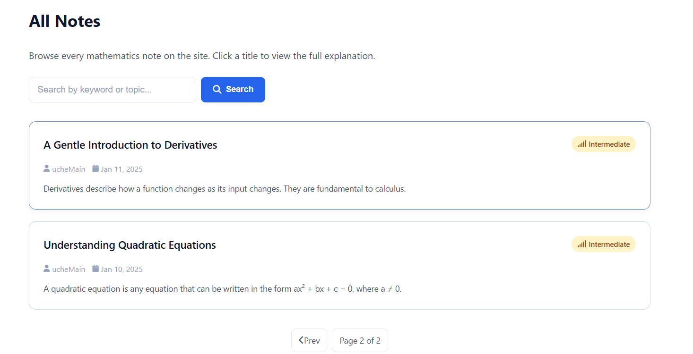

</details>

##### Back to [top](#table-of-contents) `<hr>`

---

# Tools and Technologies Used

### Core Stack

* **Python 3**
* **Django Framework**
* **HTML5, CSS3, JavaScript**
* **SQLite (development)**
* **Django Test Framework (unit test-based)**
* **WhiteNoise (static file handling in production)**
* **Ruff / Flake8 (PEP8 linting)**
* **Black (code formatting)**

### Developer and Deployment Tools

* Git & GitHub
* GitHub Projects (Agile Kanban)
* VS Code
* Heroku / Render deployment
* PE8 CI Linting
* Django Messages Framework

---

# Agile Development

The project was developed using Agile principles with:

* **Epics**, broken into:

  * Authentication
  * CRUD Blog Posts
  * Database Design
  * UX & Frontend
  * Testing
  * Deployment
* **User stories** linked to tasks
* **GitHub Issues** with labels
* **Kanban board** for sprint organisation

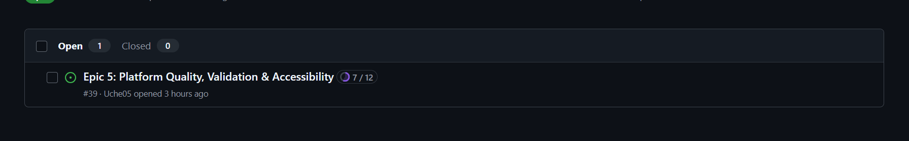
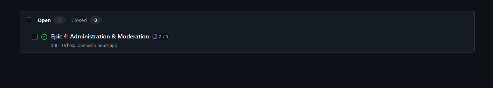
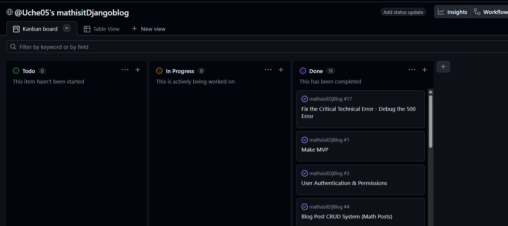

- Throughout development, features were implemented incrementally and verified using
  automated tests before progressing to the next task. Bugs and regressions discovered
  during testing were logged and resolved immediately to ensure stable feature delivery.

# Testing

Go to `<a href="TESTING.md">`TESTING.md `</a>`

## Test Results Summary

After implementing fixes for form validation issues, all automated tests now pass successfully. The fixes included:

1. Making the difficulty field optional in PostForm (since it has a default in the model)
2. Adding appropriate empty_label for the difficulty field
3. Updating test data to use lowercase difficulty values matching model choices
4. Correcting case sensitivity issues in test data (e.g., "Beginner" → "beginner")

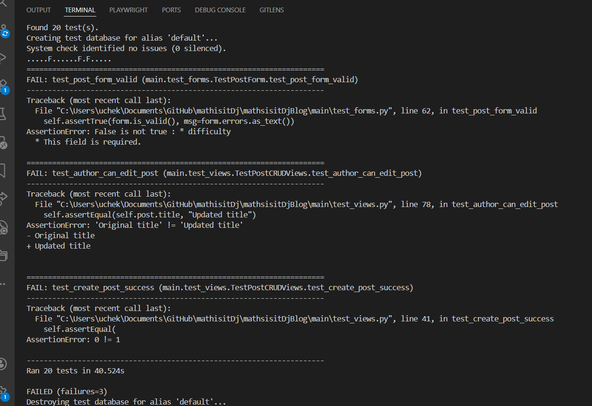
*Figure: Final test run showing all 20 tests passing*

After the Contact Model is added:

## User Stories (MathsIsIt Blog)

**Visitors**

1. As a visitor, I want to browse mathematics posts so that I can learn new concepts.
2. As a visitor, I want to read full blog articles with mathematical notation so that I can understand detailed explanations.
3. As a visitor, I want to easily navigate the site using keyboard and screen reader so that the site is accessible.
4. As a visitor, I want to see clear error messages if I try to access restricted features so that I know why access is denied.
5. As a visitor, I want to search for posts by keyword or topic so that I can quickly find relevant content.
6. As a visitor, I want to view author profiles so that I can learn about the contributors.
7. As a visitor, I want to see when a post was published or updated so that I know how current the information is.
8. As a visitor, I want to view posts by category or tag so that I can explore related topics.
9. As a visitor, I want to see a responsive design that works on all devices so that I can browse on mobile or desktop.
10. As a visitor, I want to see a visually clear and professional layout so that reading is comfortable.

**Users**
11. As a user, I want to register for an account so that I can contribute content.
12. As a user, I want to log in securely so that my account is protected.
13. As a user, I want to reset my password if I forget it so that I can regain access.
14. As a user, I want to create new blog posts so that I can share my knowledge.
15. As a user, I want to edit my own posts so that I can update or correct information.
16. As a user, I want to delete my own posts so that I can remove outdated or unwanted content.
17. As a user, I want to receive validation errors if I submit incomplete or invalid forms so that I can correct mistakes.
18. As a user, I want to be prevented from creating duplicate posts or slugs so that URLs remain unique.
19. As a user, I want to see confirmation before deleting a post so that I do not remove content by accident.
20. As a user, I want to be notified if my session expires so that I know to log in again.
21. As a user, I want to see feedback messages after actions (success or error) so that I know what happened.
22. As a user, I want to view a dashboard of my posts so that I can manage my content easily.
23. As a user, I want to edit my profile information so that my details are up to date.
24. As a user, I want to bookmark or favourite posts so that I can revisit them later.
25. As a user, I want to comment on posts to ask questions or provide feedback (future enhancement).

**Admin / Authorised User**

26. As an admin, I want full control of users and posts via Django Admin so that I can manage the site. As an Admin I can create, read, update, and delete any post.
27. As an admin, I want to filter and search users and posts in the admin panel so that I can find information quickly.
28. As an admin, I want to see audit trails of post edits (future enhancement) so that I can track changes.

**Accessibility**
29. As any user, I want the site to be responsive and usable on all devices so that I have a good experience everywhere.
30. As any user, I want the site to meet accessibility standards (color contrast, ARIA labels, etc) so that it is usable by everyone.

**Site Owner**

31. As a Site Owner I can provide a fully responsive site for my users so that they have a good user experience.
32. As a Site Owner I can validate data entered into my site so that all submitted data is correct to avoid errors.

# Deployment

Before deployment, all automated tests were executed locally to ensure production
stability. Deployment-specific issues (such as missing middleware dependencies)
were identified through test failures and resolved prior to final release.

The Mathematics Learning Blog was deployed to a cloud platform using these steps:

1. Create a new app on Heroku or Render
2. Set environment variables (SECRET_KEY, DEBUG, DATABASE_URL)
3. Add `requirements.txt`
4. Add `Procfile` (Heroku)
5. Push project to GitHub
6. Connect repo to deployment platform
7. Deploy
8. Test deployed version for consistency

Security Measures:

* DEBUG=False in production
* Environment variables for secrets
* `.gitignore` excludes sensitive files

---

# Credits

### Code & Documentation Resources

* Django Documentation
* W3C Validators
* StackOverflow
* Code Institute
* ChatGPT (debug support, explanations)

### Acknowledgements

Thanks to classmates, instructors, and mentors for feedback and guidance during development. I used Aaron's Proejct as an inspo for my readmes. ())

---

# 8. Summary

All key requirements for a fully functioning CRUD application were tested thoroughly.
Authentication, responsiveness, and database operations all behave as expected. This work involved some edits and suggestions from ChatGPT due to time constraints on my part plus what I took from the I think before I post blog lesson. Kind regards.

---
