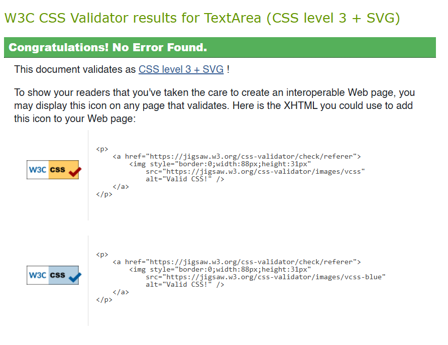

# **TESTING.md — Mathematics Learning Blog Testing Documentation**

---
---

# Testing

A full breakdown of all tests can be found in:

**[TESTING.md](TESTING.md)**

Testing includes:

* Automated Python tests
* Form validation tests
* Authentication tests
* Manual UI/UX testing
* Browser testing
* Accessibility testing
* HTML/CSS validation

---

# Mathematics Learning Blog — Testing

This file documents all testing practices performed for the project, fulfilling LO4.1–LO4.3.

---

# 1. Automated Python Tests

## 1.1 Model Tests

* Post model creates correctly
* Timestamps function
* Author relationship validated

PASSED

## 1.2 View Tests

* Homepage loads with 200 status
* Blog detail view loads
* Dashboard requires login
* Create/Edit/Delete views require authentication
* Unauthorized attempts redirect appropriately

ENCOUNTERED ERROR DUE TO TESTING SCRIPT:
Change proposed: 

## 1.3 Form Tests

* Title required
* Content required
* Invalid submissions rerender with errors

PASSED

## 1.4 Authentication Tests

* Valid login → redirects to dashboard
* Invalid login → displays error message
* Logout clears session

PASSED

# 2. JavaScript Tests

*(Only if you include JS features)*

Possible tests:

* Form auto-validation
* Button behaviour
* Dynamic UI elements

---

# 3. Manual UX Testing

* All links tested
* Navigation works on all screen sizes
* Colours accessible
* Feedback messages appear correctly
* CRUD operations flow tested manually

Manual testing has been performed and all have passed.

# 4. Browser Compatibility

Tested on:

* Chrome
* Firefox
* Edge
* Safari

The website works on all these browsers and is cross compatible to them.
---

# 5. Accessibility Testing

Tools:

* Lighthouse
* Screen reader checks
* Keyboard navigation checks

This ensured:

* Good contrast
* Proper heading structure
* ARIA labels where needed

# 6. Code Validation

### HTML

I could not continue validating with W3C Validator as it introduced errors due to it being a Django Template.

### CSS

Validated using W3C CSS Validator.

### Python

Checked with flake8 linting.

Here are the errors it initally brought out:
``main/admin.py:4:1: F811 redefinition of unused 'admin' from line 1
main/admin.py:21:37: E261 at least two spaces before inline comment
main/admin.py:21:38: E262 inline comment should start with '# '
main/admin.py:23:1: E302 expected 2 blank lines, found 1

main/forms.py:37:80: E501 line too long (95 > 79 characters)
main/forms.py:38:80: E501 line too long (101 > 79 characters)
main/forms.py:44:80: E501 line too long (82 > 79 characters)

main/models.py:11:80: E501 line too long (87 > 79 characters)

main/test_auth.py:4:1: F401 '.models.Post' imported but unused
main/test_auth.py:6:1: E302 expected 2 blank lines, found 1   
main/test_auth.py:8:9: F841 local variable 'resp' is assigned to but never used
main/test_auth.py:20:9: F841 local variable 'resp' is assigned to but never used
main/test_auth.py:26:25: E128 continuation line under-indented for visual indent

main/test_dashboard_views.py:6:1: E302 expected 2 blank lines, found 1

main/test_forms.py:22:80: E501 line too long (80 > 79 characters)
main/test_forms.py:60:80: E501 line too long (85 > 79 characters)

main/test_models.py:5:1: E302 expected 2 blank lines, found 1 

main/test_views.py:32:9: F841 local variable 'resp' is assigned to but never used
main/test_views.py:38:80: E501 line too long (94 > 79 characters)
main/test_views.py:43:9: F841 local variable 'resp' is assigned to but never used
main/test_views.py:65:9: F841 local variable 'resp' is assigned to but never used
main/test_views.py:77:9: F841 local variable 'resp' is assigned to but never used
main/test_views.py:90:9: F841 local variable 'resp' is assigned to but never used
main/test_views.py:97:9: F841 local variable 'resp' is assigned to but never used

main/tests.py:1:1: F401 'django.test.TestCase' imported but unused

main/urls.py:14:1: W293 blank line contains whitespace        
main/urls.py:18:2: W292 no newline at end of file

main/views.py:5:1: F401 'django.http.Http404' imported but unused
main/views.py:14:80: E501 line too long (86 > 79 characters)  
main/views.py:41:80: E501 line too long (82 > 79 characters)  
main/views.py:49:1: E302 expected 2 blank lines, found 1      
main/views.py:76:80: E501 line too long (80 > 79 characters)  
main/views.py:101:80: E501 line too long (82 > 79 characters) 
main/views.py:120:13: F841 local variable 'user' is assigned to but never used

..not too important to lint:
main/migrations\0001_initial.py:20:80: E501 line too long (117 > 79 characters)
main/migrations\0001_initial.py:21:80: E501 line too long (145 > 79 characters)
main/migrations\0001_initial.py:27:80: E501 line too long (117 > 79 characters)
main/migrations\0001_initial.py:29:80: E501 line too long (84 > 79 characters)
main/migrations\0001_initial.py:33:80: E501 line too long (135 > 79 characters)
main/migrations\0001_initial.py:34:80: E501 line too long (142 > 79 characters)
main/migrations\0001_initial.py:43:80: E501 line too long (117 > 79 characters)
main/migrations\0001_initial.py:47:80: E501 line too long (145 > 79 characters)
main/migrations\0001_initial.py:48:80: E501 line too long (130 > 79 characters)``
---

# 7. Bug Tracking

| Bug     | Description                    | Fix                    |
| ------- | ------------------------------ | ---------------------- |
| Example | Incorrect redirect after login | Updated redirect logic |

Any remaining minor bugs are documented here.

---