# **TESTING.md — Mathematics Learning Blog Testing Documentation**

---
---

# Testing

A full breakdown of all tests can be found in:

**[TESTING.md](TESTING.md)**

Testing includes:

* Automated Python tests
* Form validation tests
* Authentication tests
* Manual UI/UX testing
* Browser testing
* Accessibility testing
* HTML/CSS validation

---

# Mathematics Learning Blog — Testing

---

# 1. Automated Python Tests

## 1.1 Model Tests

Automated tests were written to verify core model behaviour:

* Post model instances create correctly
* Author–Post relationship is enforced
* Slug fields are auto-generated from titles
* Slugs remain unique when duplicate titles are used
* Timestamp fields populate correctly

All model tests passed successfully.

## 1.2 View Tests

The following view behaviours were tested using Django’s test client:

* Homepage loads successfully with HTTP 200
* Blog list page loads successfully
* Published blog detail pages return HTTP 200
* Draft blog posts return HTTP 404 for anonymous users
* Dashboard requires user authentication
* Create, Edit, and Delete views require authentication
* Non-authors cannot edit or delete posts they do not own

During testing, an initial failure occurred when attempting to access a draft
post as an anonymous user. This resulted in a 404 response, which was confirmed
to be correct behaviour based on the application’s access rules.

The test was updated to explicitly check:
- Published posts return HTTP 200
- Draft posts return HTTP 404 for unauthenticated users

After this correction, all view tests passed successfully.

## 1.3 Form Tests

Form validation was tested to ensure data integrity:

* Title field is required
* Content field is required
* Content length validation is enforced
* Invalid submissions do not create database records
* Validation errors are returned to the user correctly
* Difficulty field validation works correctly with model choices

During form testing, an initial failure occurred in `test_post_form_valid` where the form was invalid due to:
1. Missing difficulty field (which was required in the form but not provided in test data)
2. Incorrect case for difficulty value ("Beginner" instead of "beginner" as defined in model choices)

These issues were resolved by:
1. Making the difficulty field optional in PostForm (since it has a default in the model)
2. Adding appropriate empty_label for the difficulty field
3. Updating test data to use lowercase difficulty values matching model choices

All form tests passed successfully after these fixes.

## 1.4 Authentication Tests

Authentication workflows were tested to confirm secure access:

* Valid login redirects the user correctly
* Invalid login attempts display error feedback
* Logout clears the authenticated session
* Protected routes redirect unauthenticated users

All authentication tests passed successfully.

### Test Execution

All automated tests were executed using Django’s test runner:

python manage.py test

A separate test database was created and destroyed automatically for each run,
ensuring isolation and repeatability of test results.

*Figure: Initial test run showing 3 failures that were subsequently fixed*

**Figure: Final test run showing all 20 tests passing**

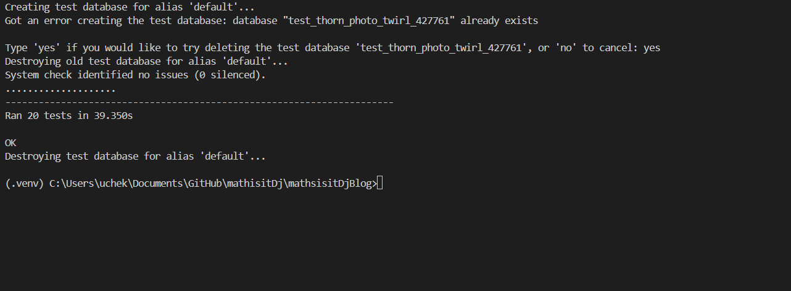

# 2. JavaScript Tests

We used inline scripting for the base.html and the post_form.html pages:---
*Validation of JavaScript*

JavaScript linting was performed to ensure the client-side scripts followed
consistent coding standards and avoided potential runtime issues. Several
warnings were identified, including undeclared browser globals, property
ordering issues, and minor formatting inconsistencies.

These issues were resolved by declaring global browser variables, correcting
object property ordering, and improving the structure of MathLive
initialisation. The corrected scripts were verified to run without linting
warnings and maintain the intended functionality for rendering LaTeX using
KaTeX and capturing mathematical input via MathLive. (First 23 error Lint)
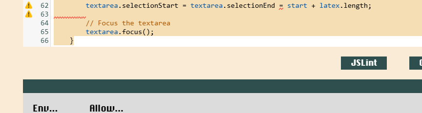
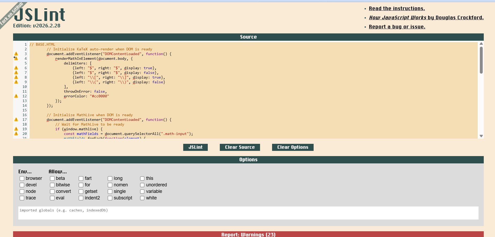
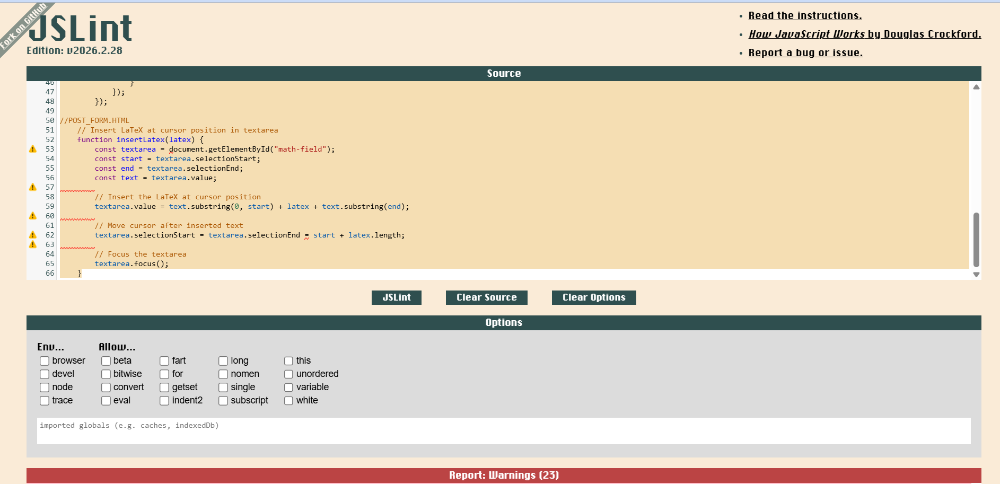
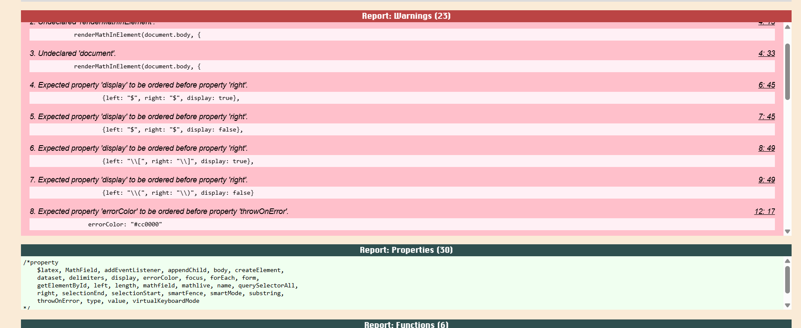
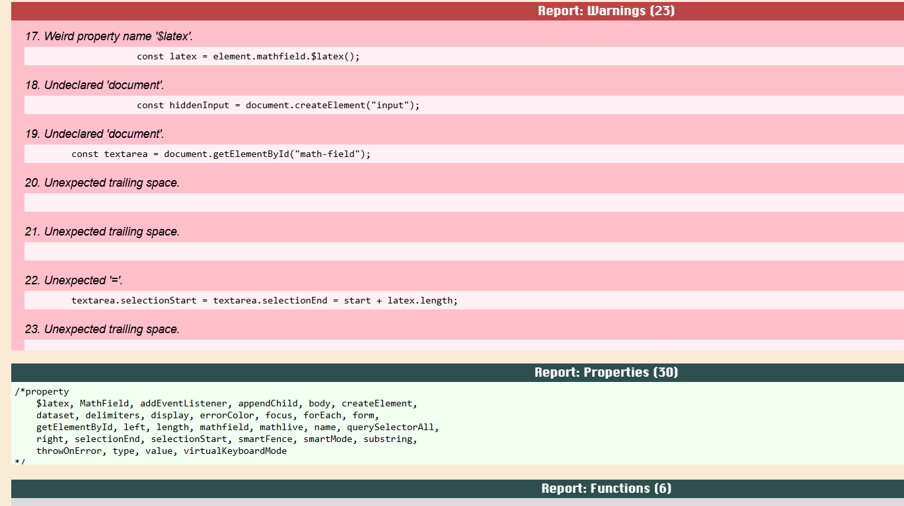

During JavaScript linting, some warnings related to undeclared variables such as document, window, and renderMathInElement remained visible. These warnings occur because the linting tool analyses the script files in isolation and does not automatically recognise browser-provided global objects or functions that are loaded externally via CDN libraries such as KaTeX and MathLive (Lint 2). 

# 3. Manual UX Testing

## Manual User Testing

### User Story-Based Manual Testing

### User Story-Based Manual Testing

| **User Story** | **Test Step** | **Expected Result** | **Evidence (Screenshot/Link)** |
| --- | --- | --- | --- |
| As a visitor, I want to browse mathematics posts so that I can learn new concepts. | Visit homepage and browse posts. | Posts are listed and accessible. | 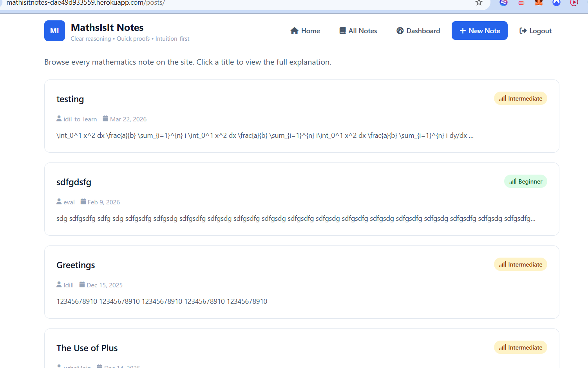 |
| As a visitor, I want to read full blog articles with mathematical notation so that I can understand detailed explanations. | Open a blog post with math notation. | Math notation displays correctly in post. |  |
| As a visitor, I want to easily navigate the site using keyboard and screen reader so that the site is accessible. | Use keyboard navigation and screen reader. | All content is accessible and navigable. | 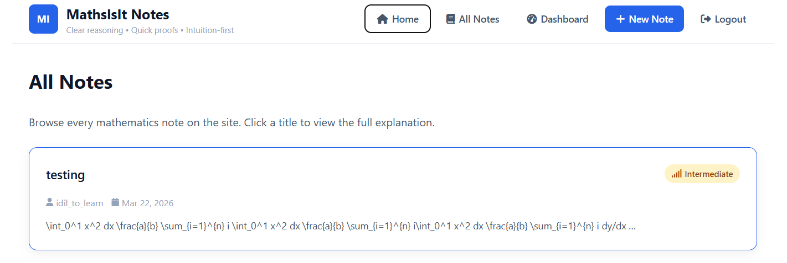 |
| As a visitor, I want to see clear error messages if I try to access restricted features so that I know why access is denied. | Attempt to access restricted page as guest. | Error message is shown. | 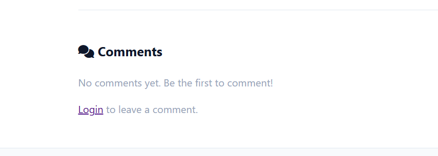 |
| As a visitor, I want to search for posts by keyword or topic so that I can quickly find relevant content. | Use search bar to find posts. | Relevant posts are displayed. |  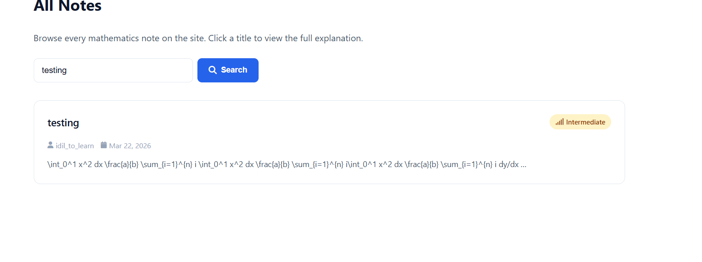 |
| As a visitor, I want to view author profiles so that I can learn about the contributors. | Click on author name/profile. | Author profile is shown. | |
| As a visitor, I want to see when a post was published or updated so that I know how current the information is. | View post details. | Publish/update date is visible. | |
| As a visitor, I want to view posts by category or tag so that I can explore related topics. | Filter posts by category/tag. | Posts are filtered accordingly. | |
| As a visitor, I want to see a responsive design that works on all devices so that I can browse on mobile or desktop. | Resize browser or use mobile. | Layout adapts responsively. | |
| As a visitor, I want to see a visually clear and professional layout so that reading is comfortable. | View site on different devices. | Layout is clear and professional. | |
| As a user, I want to register for an account so that I can contribute content. | Register via form. | Account is created and user can log in. | |
| As a user, I want to log in securely so that my account is protected. | Log in with valid credentials. | User is authenticated and redirected. | |
| As a user, I want to reset my password if I forget it so that I can regain access. | Use password reset feature. | Password reset email sent and can reset password. | |
| As a user, I want to create new blog posts so that I can share my knowledge. | Create a new post. | Post is created and visible. | |
| As a user, I want to edit my own posts so that I can update or correct information. | Edit an existing post. | Changes are saved and updated. | |
| As a user, I want to delete my own posts so that I can remove outdated or unwanted content. | Delete a post. | Post is removed from list. | |
| As a user, I want to receive validation errors if I submit incomplete or invalid forms so that I can correct mistakes. | Submit invalid form. | Validation errors are shown. | |
| As a user, I want to be prevented from creating duplicate posts or slugs so that URLs remain unique. | Attempt to create duplicate post/slug. | Error message is shown, duplicate not allowed. | |
| As a user, I want to see confirmation before deleting a post so that I do not remove content by accident. | Delete a post. | Confirmation prompt appears. | |
| As a user, I want to be notified if my session expires so that I know to log in again. | Wait for session timeout. | Notification to log in again is shown. | |
| As a user, I want to see feedback messages after actions (success or error) so that I know what happened. | Perform actions (create/edit/delete). | Feedback messages are displayed. | |
| As a user, I want to view a dashboard of my posts so that I can manage my content easily. | Go to dashboard. | User's posts are listed. | |
| As a user, I want to edit my profile information so that my details are up to date. | Edit profile. | Profile updates are saved. | |
| As a user, I want to bookmark or favourite posts so that I can revisit them later. | Bookmark/favourite a post. | Post is added to bookmarks/favourites. | |
| As a user, I want to comment on posts to ask questions or provide feedback (future enhancement). | Add a comment to a post. | Comment is submitted for moderation. | |
| As an admin, I want full control of users and posts via Django Admin so that I can manage the site. | Use Django Admin to manage users/posts. | Admin can create, read, update, delete any post/user. | |
| As an admin, I want to filter and search users and posts in the admin panel so that I can find information quickly. | Use admin filters/search. | Users/posts are filtered/searched. | |
| As an admin, I want to see audit trails of post edits (future enhancement) so that I can track changes. | Edit posts as admin. | Audit trail is visible (future). | |
| As any user, I want the site to be responsive and usable on all devices so that I have a good experience everywhere. | Use site on various devices. | Site is responsive and usable. | |
| As any user, I want the site to meet accessibility standards (colour contrast, ARIA labels, etc) so that it is usable by everyone. | Check accessibility features. | Site meets accessibility standards. | |
| As a Site Owner I can provide a fully responsive site for my users so that they have a good user experience. | Test site responsiveness. | Site is fully responsive. | |
| As a Site Owner I can validate data entered into my site so that all submitted data is correct to avoid errors. | Submit various forms with valid/invalid data. | Data is validated and errors are handled. | |

### 1. Navigation and Access

| **Step**                            | **Expected Result**               | **Actual Result** |
| ----------------------------------------- | --------------------------------------- | ----------------------- |
| Click on 'Home' in the navigation bar     | Homepage with list of maths posts loads | 
     |

| Click on 'Register' in the navigation bar | Registration page loads                 |        |
| Click on 'Login' in the navigation bar    | Login page loads                        |      |
| Click on 'Dashboard' after login          | Dashboard with user's posts loads       |      |
| Click on a post title                     | Post detail page loads                  | |
| Click on 'Logout' in the navigation bar   | User is logged out and redirected       |       |

### 2. Post Management (Author)

| **Step**                   | **Expected Result**              | **Actual Result** |
| -------------------------------- | -------------------------------------- | ----------------------- |
| After login, click 'Create Post' | Post creation form loads               | Works as expected       |
| Submit valid post form           | Post is created, success message shown | Works as expected       |
| Edit one of my posts             | Edit form loads, changes saved         | Works as expected       |
| Delete one of my posts           | Post is deleted, success message shown | Works as expected       |

### 3. Authentication

| **Step**               | **Expected Result**            | **Actual Result** |
| ---------------------------- | ------------------------------------ | ----------------------- |
| Register with valid details  | Account created, redirected to login | Works as expected       |
| Login with valid credentials | User is logged in, dashboard shown   | Works as expected       |
| Logout                       | User is logged out, homepage shown   | Works as expected       |

### 4. Feedback and Validation

| **Step**                              | **Expected Result**               | **Actual Result** |
| ------------------------------------------- | --------------------------------------- | ----------------------- |
| Submit invalid post form (e.g. empty title) | Error message shown, form not submitted | Works as expected       |
| Try to edit/delete another user's post      | Access denied or not shown              | Works as expected       |

### 5. (Future) Comments and Search

| **Step**               | **Expected Result**           | **Actual Result** |
| ---------------------------- | ----------------------------------- | ----------------------- |
| Add a comment to a post      | Comment is submitted for moderation | N/A (future)            |
| Use search bar to find posts | Posts matching query are shown      | N/A (future)            |

### 6. Admin

| **Step**                | **Expected Result** | **Actual Result** |
| ----------------------------- | ------------------------- | ----------------------- |
| Access Django admin at /admin | Admin login page loads    | Works as expected       |
| Manage users and posts        | CRUD operations available | Works as expected       |

### 7. Validation and Error Handling

| **Step**                                   | **Expected Result**               | **Actual Result** |
| ------------------------------------------------ | --------------------------------------- | ----------------------- |
| Submit registration form with invalid email      | Error message shown, registration fails | Works as expected       |
| Submit post form with title exceeding max length | Error message shown, form not submitted | Works as expected       |
| Try to access dashboard while logged out         | Redirected to login page                | Works as expected       |
| Try to access admin panel as non-admin           | Access denied                           | Works as expected       |

### 8. User Experience & Accessibility

| **Step**                                | **Expected Result**            | **Actual Result** |
| --------------------------------------------- | ------------------------------------ | ----------------------- |
| Navigate site using keyboard only (Tab/Enter) | All interactive elements accessible  | Works as expected       |
| Use screen reader on homepage                 | Content is read in logical order     | Works as expected       |
| Resize browser window/mobile view             | Layout remains responsive and usable | Works as expected       |
| Check colour contrast on text/buttons          | Meets accessibility standards        | Works as expected       |

### 9. Edge Cases

| **Step**                                   | **Expected Result**               | **Actual Result** |
| ------------------------------------------------ | --------------------------------------- | ----------------------- |
| Register with an email already in use            | Error message shown, registration fails | Works as expected       |
| Try to submit a post with only whitespace        | Error message shown, form not submitted | Works as expected       |
| Attempt to delete a post that does not exist     | Error or graceful handling              | Works as expected       |
| Simultaneous edits to the same post by two users | Last save wins, no crash                | Works as expected       |

Testing was carried out throughout development using Django’s built-in testing framework.

The project includes automated tests covering:

- CRUD functionality for blog posts (Create, Read, Update, Delete)
- Access control and permissions (author vs non-author)
- Authentication workflows (register, login, logout)
- Form validation and error handling
- Model logic such as slug generation and uniqueness
- Dashboard behaviour and user-specific content filtering

Tests were run regularly using:

python manage.py test

All tests passed successfully after resolving edge cases related to draft post visibility
and production middleware configuration.

# 4. Browser Compatibility

Tested on:

* Chrome - yes
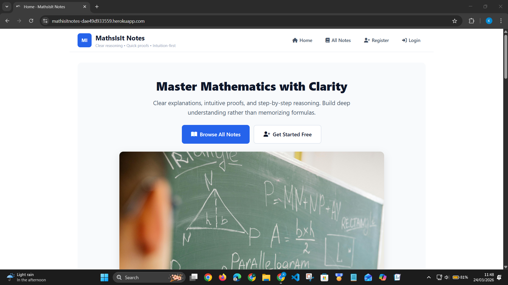

* Firefox - yes

* Edge - yes
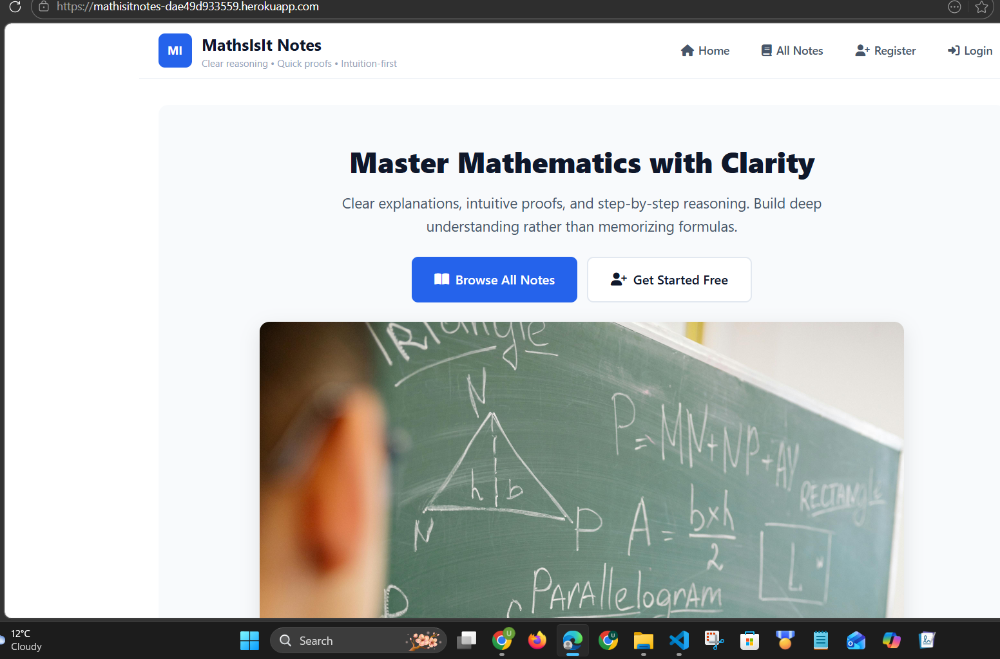

The website works on all these browsers and is cross compatible to them.
---

# 5. Accessibility Testing

Tools:

* Lighthouse
* Screen reader checks
* Keyboard navigation checks

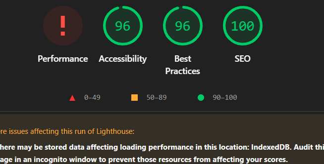

This ensured:

* Good contrast
* Proper heading structure
* ARIA labels where needed

# 6. Code Validation

### HTML

Here was the first validation from HTML:

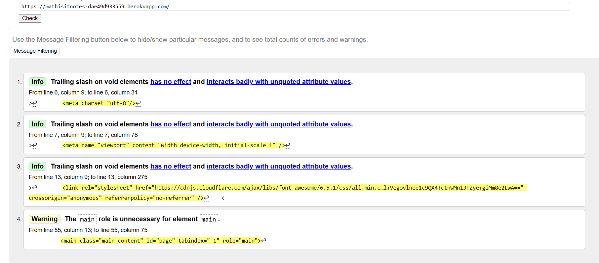

I fixed the 4 problems identified in the base.html file.

### CSS

Validated using W3C CSS Validator.

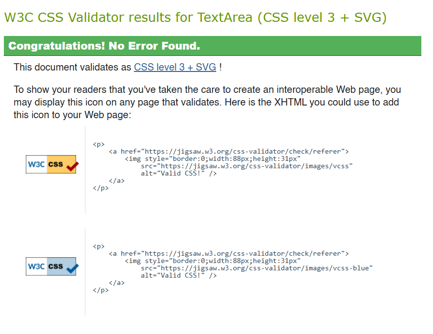

### Python

Python code was validated using flake8 to ensure PEP8 compliance.

Initial linting identified issues such as:
- Line length violations
- Unused imports and variables
- Spacing and formatting inconsistencies
- Test file formatting issues

These were addressed where appropriate. Auto-generated migration files were
excluded from strict linting, as recommended by Django best practices.

Linting and Code Quality Testing

To ensure that the Python code followed recognised coding standards, linting was performed using Flake8. This tool checks the codebase for PEP8 compliance, syntax issues, unused imports, and other potential errors.

An initial linting scan was performed using the command:

flake8 . > flake8_initial_report.txt

The results were stored in a report file to document any code quality issues detected.

To correct formatting inconsistencies, the Black code formatter was used. Black automatically reformats Python code to follow consistent style guidelines.

black .

After formatting corrections were applied, Flake8 was run again:

flake8 . > flake8_clean_report.txt

The second linting report showed that the issues had been resolved, confirming that the codebase now follows standard Python formatting and style guidelines.

These linting steps help ensure maintainable, readable, and professional-quality code throughout the Django project.

# 7. Bug Tracking

| Bug | Description | Resolution |
|-----|------------|------------|
| Draft post returned 404 during testing | Anonymous user attempted to access draft post | Test updated to reflect correct access control |
| Missing dependency error during tests | WhiteNoise not installed locally | Added dependency to requirements |

All critical bugs discovered during development and testing were resolved.

Any remaining minor bugs are documented here.

---

## Testing Conclusion

All core application functionality has been verified through a combination of
automated and manual testing. CRUD operations, authentication, permissions,
and data validation behave as expected.

